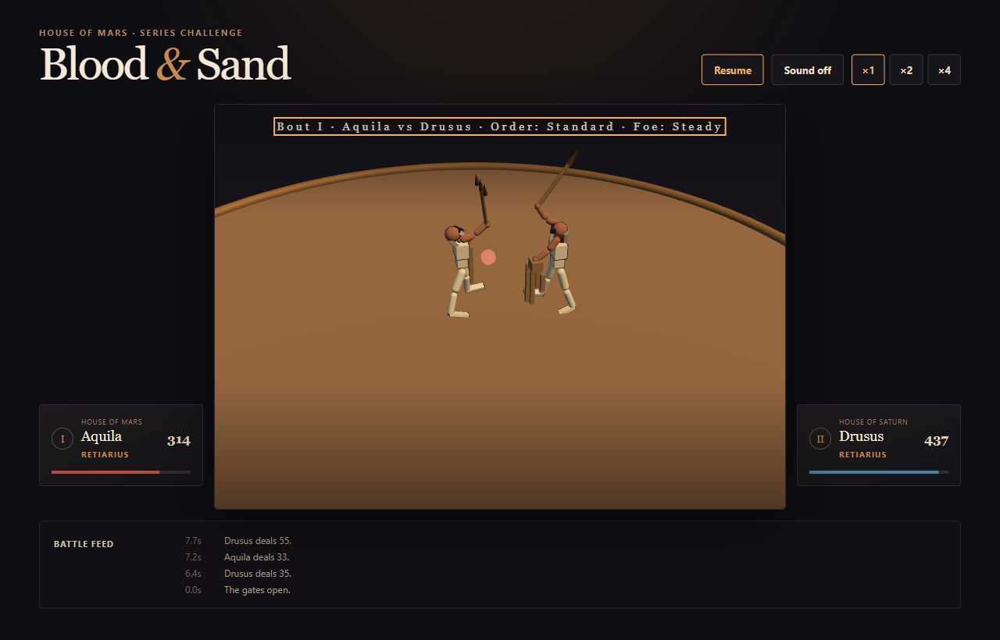
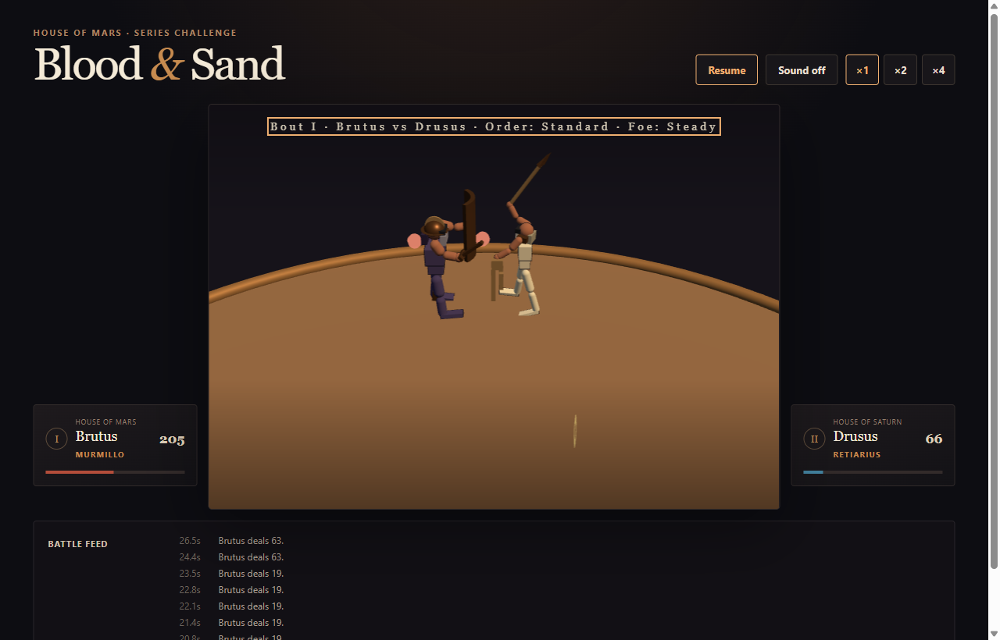

# Retiarius reach — playtest, 2026-08-27

**Slice:** retiarius reach (PR #16 merged, PR #17 draft). The retiarius'
committed attack moved from the arena's 0.90 minimum separation to a contact
median of 1.90, and the counter triangle was recalibrated around it.

**Entry point:** `docs/reviews/2026-08-25-gladiator-types-playtest.md`, whose
finding was:

> «дистанция удара осталась у всех одинаковая — даже с копьём и трезубцем
> нужно подойти вплотную чтобы ударить. И не всегда с длинным оружием бойцы
> рвут дистанцию»

**Reviewer:** none yet. **This document is not the human review gate.** It is
an instrumented pass over the live build by the implementer, which the design
explicitly does not accept as the gate — that needs two humans who did not
implement the combat. What follows is evidence to point them at, and one
finding they should be told about before they start.

## What the acceptance gates measure, and what they do not

Every reach gate passes. But they all answer the same shape of question:
**"when a blow lands, how far apart were the fighters?"** None of them asks
**"where does the fight actually take place?"** — and that second question is
the one the original playtest finding was about. A viewer does not see a
conditional distribution over contacts; they see two figures and the ground
between them.

So this pass measured time-at-distance directly: the separation on **every
tick** of every bout involving a retiarius, before and after, 40 seeds per
pairing, ~360 000 ticks each side.

## The fight did move out — by 8 points, and unevenly

| all retiarius bouts, per tick | before | after | |
|---|---:|---:|---|
| median separation | 1.81 | **2.00** | +0.19 |
| at the arena floor (<1.0) | 9.1% | **7.4%** | −1.7 pts |
| **inside the murmillo's reach (<1.7)** | **45.8%** | **37.7%** | **−8.1 pts** |
| in the trident's own band (1.7–2.4) | 24.5% | **27.5%** | +3.0 pts |
| beyond 2.4 | 29.7% | **34.8%** | +5.1 pts |

Real, and in the direction the slice claimed. But the average hides the
finding, which is in the per-pairing split:

| pairing | inside 1.7, before | after | |
|---|---:|---:|---|
| `aquila/drusus` — retiarius vs retiarius | 30.9% | **16.4%** | −14.5 pts |
| `nerva/drusus` — hoplomachus vs retiarius | 30.0% | **19.8%** | −10.2 pts |
| `aquila/cassius` — retiarius vs hoplomachus | 30.0% | **20.6%** | −9.4 pts |
| `brutus/drusus` — **murmillo** vs retiarius | 47.1% | **43.9%** | −3.2 pts |
| `aquila/magnus` — retiarius vs **murmillo** | 43.5% | **43.0%** | −0.5 pts |

**Against every opponent except the murmillo, the fight moved out
substantially. Against the murmillo it did not move at all.**

That is not a surprise once stated — it is the same wall the balance work spent
its whole budget on. The murmillo's entire game is closing inside the trident's
1.60 floor, where the retiarius' committed attack is *illegal*. The gates went
green because the blows that used to land at 0.90 became geometry misses, not
because the pair separated.

## What that looks like

**The type working.** Two retiarii at 2.06 units, tridents up, real ground
between them — `aquila vs drusus`, tick 461, a lunge connecting against an
evade.



**The type pinned.** `brutus vs drusus`, tick 1658, both fighters mid-windup on
their committed attacks at **1.547** — which is *below* the trident's own 1.60
floor, so the lunge in this frame is already a geometry miss before it starts.



## The second thing to look at: the lunge became rare

Over the same 40-seed sample, `fast-burst-lunge` connections fell from **2095
to 786** — a 62% drop. In `brutus vs drusus` it lands about 2.4 times per bout;
in one sampled bout it landed **once in 1827 ticks**.

The retiarius' offence moved to his probe: `fast-slash` went from 0.68 to 1.65
damage with recovery halved. He now jabs with the point of the trident
constantly and commits rarely.

**Is that a retiarius, or a spammer?** The numbers cannot answer it. It is the
first thing a reviewer should be asked.

## Three consequences the hypothesis did not promise

1. **The murmillo's cleave is a different weapon.** 1.98 → 2.70 damage at
   recovery 34 → 56: rarer, far heavier. This was the price of not crossing the
   authored ordering "the cleave is the single highest-payoff action in the
   game". Does the murmillo still read as the murmillo?
2. **Bouts changed hands.** Brutus now beats Drusus where he used to lose.
   Anyone who remembers the old bouts will notice this before anything else.
3. **`aquila/magnus` sits exactly on the band floor** — 15.0%, i.e. the
   retiarius loses about 85 of 100. Formally in band, and the correct direction
   for the counter triangle. Whether losing *feels* like the triangle working
   or like a broken matchup is exactly what numbers cannot say.

## What not to judge

- The parry-to-counter conversion after `technical-driving-thrust` (~80%) is a
  pre-existing property of the authored content, not this slice.
- The one failing unit test is a camera *metric* defect — it conflates axis
  motion with released dead-zone lag. The damped output a player sees is
  unaffected and every legibility check passes at all three viewports.

## Verdict on the slice's own question

> the man carrying a trident should not fight closer than the man carrying a
> short sword

**Half held.** Against the spear and against his own kind, the retiarius now
fights at a distance he chose. Against the short sword he does not — the
murmillo still walks inside his reach and stays there for 43% of the bout, and
the retiarius' answer is to stop using his signature attack rather than to open
the range.

Whether that half is enough is a design question, not a measurement one. The
honest framing for the reviewers: **the slice fixed the retiarius' reach and
did not fix the murmillo's ability to ignore it.**

## How to run it

```
npm run dev            # http://127.0.0.1:4173/
npm run review:clips   # nine pairing bouts, three without the HUD, one x2 series
```
